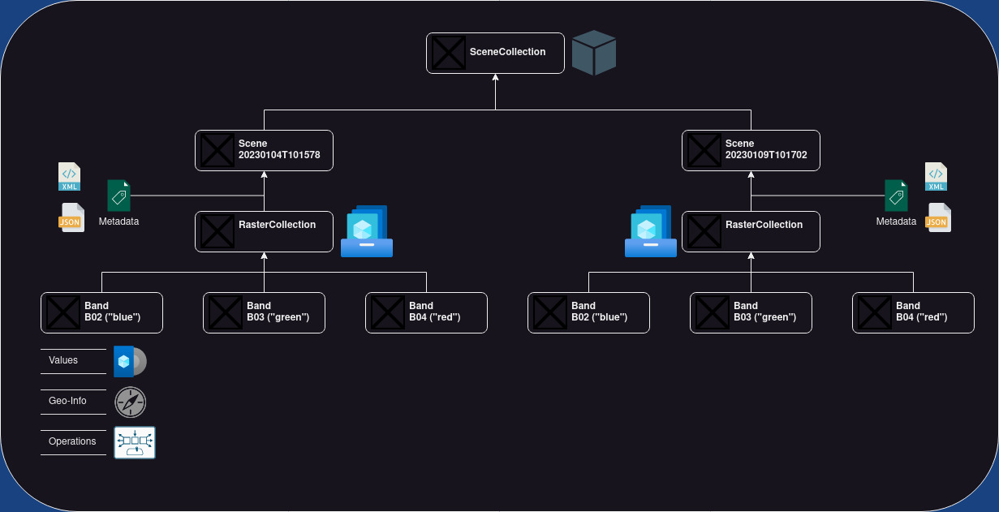

# E:earth_africa:dal Earth Observation Data Analysis Library
**A truely open-source package for unified analysis of Earth Observation (EO) data**

:heavy_check_mark: Cloud-native by design thanks to [STAC](https://stacspec.org/en)

:heavy_check_mark: EO data querying, I/O, processing, analysis and visualization in a single package

:heavy_check_mark: Modulare and lightweight architecture

:heavy_check_mark: Almost unlimited expandability with interfaces to [xarray](https://docs.xarray.dev/en/stable/), [numpy](https://numpy.org/), [geopandas](https://geopandas.org/en/stable/), and many more

## About E:earth_africa:dal

E:earth_africa:dal is a Python library enabling the acquisition, organization, and analysis of Earth observation data in a completely open-source manner within a unified framework.

E:earth_africa:dal enables open-source, reproducible geo-spatial data science. At the same time, E:earth_africa:dal lowers the burden of data handling and provides access to **global satellite data archives** through **downloaders** and the fantastic **SpatioTemporalAssetsCatalogs** (STAC).

E:earth_africa:dal supports working in **cloud-environments** using [STAC catalogs](https://stacspec.org/) ("online" mode) and on **local premises** using a spatial PostgreSQL/PostGIS database to organize metadata ("offline" mode).

Read more about E:earth_africa:dal in [this peer reviewed article](https://doi.org/10.1016/j.compag.2022.107487).

## Citing E:earth_africa:dal

We put a lot of effort in developing E:earth_africa:dal. To give us proper credit please respect our [license agreement](LICENSE). When you use E:earth_africa:dal for your **research** please **cite our paper** in addition to give us proper scientific credit.

.. code::latex

	@article{GRAF2022107487,
	title = {EOdal: An open-source Python package for large-scale agroecological research using Earth Observation and gridded environmental data},
	journal = {Computers and Electronics in Agriculture},
	volume = {203},
	pages = {107487},
	year = {2022},
	issn = {0168-1699},
	doi = {https://doi.org/10.1016/j.compag.2022.107487},
	url = {https://www.sciencedirect.com/science/article/pii/S0168169922007955},
	author = {Lukas Valentin Graf and Gregor Perich and Helge Aasen},
	keywords = {Satellite data, Python, Open-source, Earth Observation, Ecophysiology},
	abstract = {Earth Observation by means of remote sensing imagery and gridded environmental data opens tremendous opportunities for systematic capture, quantification and interpretation of plant–environment interactions through space and time. The acquisition, maintenance and processing of these data sources, however, requires a unified software framework for efficient and scalable integrated spatio-temporal analysis taking away the burden of data and file handling from the user. Existing software products either cover only parts of these requirements, exhibit a high degree of complexity, or are closed-source, which limits reproducibility of research. With the open-source Python library EOdal (Earth Observation Data Analysis Library) we propose a novel software that enables the development of fully reproducible spatial data science chains through the strict use of open-source developments. Thanks to its modular design, EOdal enables advanced data warehousing especially for remote sensing data, sophisticated spatio-temporal analysis and intersection of different data sources, as well as nearly unlimited expandability through application programming interfaces (APIs).}
	}

## Data Model

E:earth_africa:dal has a sophisticated data model projecting the complexity of Earth Observation data into Python classes. The object-based design of E:earth_africa:dal has four base classes:

* [E:earth_africa:dal Band](eodal/core/band.py) is the class for handling single bands. A band is a two-dimensional raster layer (i.e., an two-dimensional array). Each raster cell takes a value. These values could represent color intensity, elevation above mean sea level, or temperature readings, to name just a few examples. A band has a name and an optional alias. Its raster grid cells are geo-referenced meaning each cell can be localized in a spatial reference system.
* [E:earth_africa:dal RasterCollection](eodal/core/raster.py) is a class that contains 0 to *n* Band objects. The bands are identified by their names or alias (if available).
* [E:earth_africa:dal Scene](eodal/core/raster.py) is essential a RasterCollection with `SceneMetadata` assigning the RasterCollection a time-stamp and an optional scene identifier.
* [E:earth_africa:dal SceneCollection](eodal/core/raster.py) is a collection of 0 to *n* Scenes. The scenes are identified by their timestamp or scene identifier (if available).

## Examples
We have compiled a set of [Jupyter notebooks](https://github.com/EOA-team/eodal_notebooks) showing you the capabilities of E:earth_africa:dal and how to unlock them.

## Contributing

Contributions to E:earth_africa:dal are welcome. Please make sure to read the [contribution guidelines](Contributing.rst) first.
