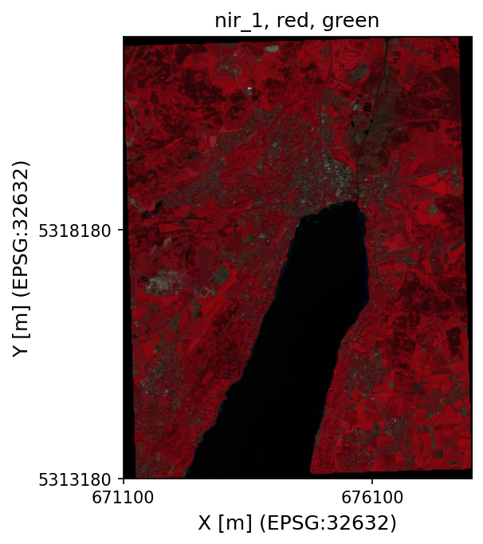
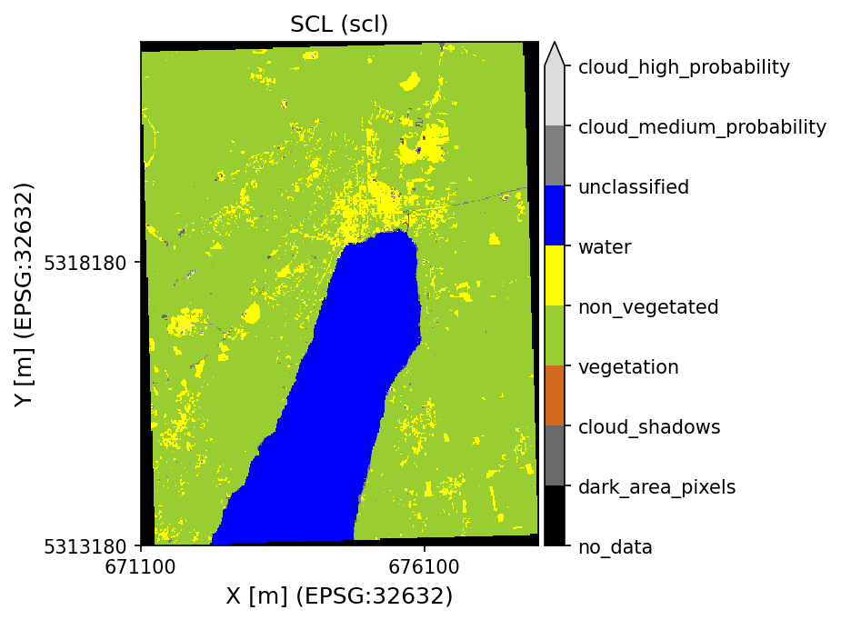

|GHA tests| |Codecov report| |pre-commit| |black|

E:earth_africa:dal Earth Observation Data Analysis Library
==========================================================

E:earth_africa:dal is a Python library enabling the acquisition, organization, and analysis of Earth observation data in a completely open-source manner.

E:earth_africa:dal Python allows to
* load
* modify
* analyze
* modify
* write
Earth Observation data within an unified framework. E:earth_africa:dal thus enables open-source, reproducible geo-spatial data science while lowering the burden of data handling on the user-side.

The roots of E:earth_africa:dal lay in **agricultural remote sensing applications** with **Sentinel-2**.
However, due to its **modular and object-oriented programming structure**, it allows the
**processing of (nearly) any type of Earth Observation data** and can be **adapted** to
**other remote sensing platforms** or **Earth Observation data sources** (e.g., Digital Elevation
Models, Soil Maps, Land Cover Maps etc.).

E:earth_africa:dal supports working in **cloud-environments** using [STAC catalogs](https://stacspec.org/) ("online" mode) and
on **local premises** using a spatial PostgreSQL/PostGIS database to organize metadata ("offline" mode).

Examples
--------

The following code snippet reads spectral bands from a Sentinel-2 scene
organized in .SAFE folder structure acquired over Southern Germany in
Level2A (bottom-of-atmosphere reflectance). The Sentinel-2 scene can be
downloaded `here <https://data.mendeley.com/datasets/ckcxh6jskz/1>`__ (
S2A_MSIL2A_20190524T101031_N0212_R022_T32UPU_20190524T130304.zip):

.. code:: python

   import geopandas as gpd
   from pathlib import Path
   from shapely.geometry import Polygon
   from eodal.core.sensors import Sentinel2

   # file-path to the .SAFE dataset
   dot_safe_dir = Path('../data/S2A_MSIL2A_20190524T101031_N0212_R022_T32UPU_20190524T130304.SAFE')

   # construct a bounding box for reading a spatial subset of the scene (geographic coordinates)
   ymin, ymax = 47.949, 48.027
   xmin, xmax = 11.295, 11.385
   bbox = Polygon([(xmin, ymin), (xmax, ymin), (xmax, ymax), (xmin, ymax)])

   # eodal expects a vector file or a GeoDataFrame for spatial sub-setting
   bbox_gdf = gpd.GeoDataFrame(geometry=[bbox], crs=4326)

   # read data from .SAFE (all 10 and 20m bands + scene classification layer)
   s2_ds = Sentinel2().from_safe(
       in_dir=dot_safe_dir,
       vector_features=bbox_gdf
   )

   # eodal support band aliasing. Thus, you can access the bands by their name ...
   s2_ds.band_names

Output

.. code:: shell

   >>> ['B02', 'B03', 'B04', 'B05', 'B06', 'B07', 'B08', 'B8A', 'B11', 'B12', 'SCL']

.. code:: python

   # ... or by their alias, i.e., their color name
   s2_ds.band_aliases

.. code:: shell

   >>> ['blue', 'green', 'red', 'red_edge_1', 'red_edge_2', 'red_edge_3', 'nir_1', 'nir_2', 'swir_1', 'swir_2', 'scl']

.. code:: python

   # plot false-color infrared preview
   s2_ds.plot_multiple_bands(band_selection=['nir_1','red','green'])

.. code:: python

   # plot scene classification layer
   s2_ds.plot_scl()

Contributing
------------

Contributions to E:earth_africa:dal are welcome. Please make sure to read the [contribution guidelines](Contributing.rst) first.

