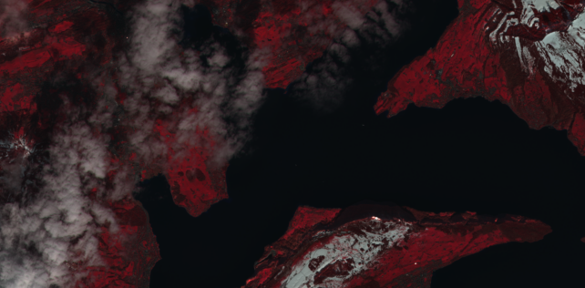

Welcome to the documentation of the Earth Observation Data Analysis Library (EOdal)
===================================================================================

A truely open-source package for unified analysis of Earth Observation (EO) data.

* cloud-native by design thanks to `STAC <https://stacspec.org/en/>`_
* access to petabytes of satellite imagery including Landsat, Sentinel-1, Sentinel-2 and PlanetScope
* EO data querying, I/O, processing, analysis and visualization in a single package
* Modulare and lightweight architecture
* Almost unlimited expandability with interfaces to `xarray <https://docs.xarray.dev/en/stable/>`_, `numpy <https://numpy.org/>`_, `geopandas <https://geopandas.org/en/stable/>`_, and many more

Getting started
---------------

EOdal can be installed from `PyPi <https://pypi.org/project/eodal/>`_ or from `source <https://github.com/EOA-team/eodal>`_.

To get started you might have a look at some Jupyter notebooks we prepared. Check them out `here <https://github.com/EOA-team/eodal_notebooks>`_

Example
-------

.. code-block:: python
   :caption: eodal_example.py

   import geopandas as gpd

    from datetime import datetime
    from eodal.core.sensors.sentinel2 import Sentinel2
    from eodal.mapper.feature import Feature
    from eodal.mapper.filter import Filter
    from eodal.mapper.mapper import Mapper, MapperConfigs
    from typing import List

    #%% user-inputs
    # -------------------------- Collection -------------------------------
    collection: str = 'sentinel2-msi'
        
    # ------------------------- Time Range ---------------------------------
    time_start: datetime = datetime(2022,3,1)  		# year, month, day (incl.)
    time_end: datetime = datetime(2022,6,30)   		# year, month, day (incl.)
        
    # ---------------------- Spatial Feature  ------------------------------
    geom: Path = Path('data/sample_polygons/lake_lucerne.gpkg')
        
    # ------------------------- Metadata Filters ---------------------------
    metadata_filters: List[Filter] = [
        Filter('cloudy_pixel_percentage','<', 80),
        Filter('processing_level', '==', 'Level-2A')
    ]
        
    # query the scenes available (no I/O of scenes, this only fetches metadata)
    feature = Feature.from_geoseries(gpd.read_file(geom).geometry)
    mapper_configs = MapperConfigs(
        collection=collection,
        time_start=time_start,
        time_end=time_end,
        feature=feature,
        metadata_filters=metadata_filters
    )

    # now, a new Mapper instance is created
    mapper = Mapper(mapper_configs)
    # query the metadata (i.e., available scenes) first
    mapper.query_scenes()
        
    # load the scenes available from STAC (reading bands B02 "blue", B03 "green", B04 "red")
    scene_kwargs = {
        'scene_constructor': Sentinel2.from_safe,
        'scene_constructor_kwargs': {'band_selection': ['B02', 'B03', 'B04'], 'read_scl': False}
    }
    mapper.load_scenes(scene_kwargs=scene_kwargs)

    # the data loaded into `mapper.data` as a EOdal SceneCollection
    mapper.data

.. include:: source/readme.rst
    :start-line: 2

.. toctree::
    :maxdepth: 2
    :caption: Table of Contents:

    packages/modules
    source/changelog
    py-modindex
    genindex
